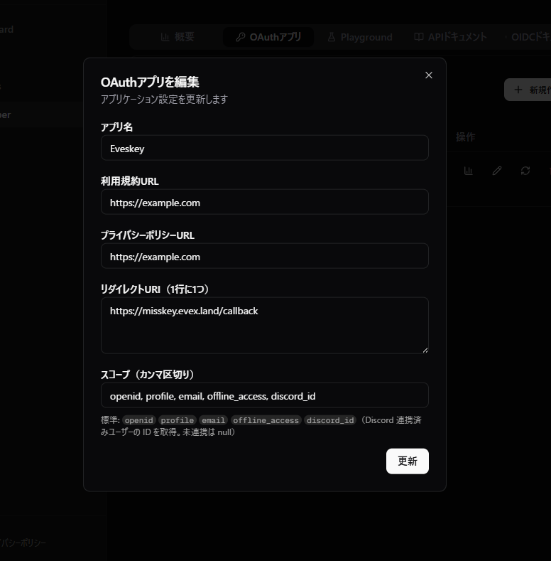

# EvexAccount ローカルビルド・ガイド
このガイドでは、ホストマシンに Node.js をインストールすることなく、Docker Compose を使用して Misskey と EvexAccount の連携フローをローカルで実行・テストする方法を解説します。

## このセットアップで実行されるもの
Misskey: Web、バックエンド、マイグレーション（Docker上）

PostgreSQL: データベース（Docker上）

Redis: キャッシュサーバー（Docker上）

## 事前準備
Linux(Ubuntu, Debian, Fedora 等)

Docker および Docker Compose (V2) がインストールされ、実行可能であること

Git（リポジトリのチェックアウト用）

## 1. 設定ファイルのコピー
リポジトリのルートディレクトリで、.config 内にあるサンプル設定ファイルをコピーして、実際に使用する設定ファイルを作成します。


```Bash
cp .config/default_example.yml .config/default.yml
cp .config/docker_example.env .config/docker.env
```

## 設定のカスタマイズ
.config/default.yml の編集:

- url: ブラウザでアクセスするアドレスを設定します(既定 https://misskey.evex.land)。

.config/docker.env の編集:
- EvexAccount の認証情報を入力します。nano や vim などのエディタを使用してください。

```
EVEXACCOUNT_CLIENT_ID=<クライアントID>
EVEXACCOUNT_CLIENT_SECRET=<クライアントシークレット>
```

## 1. スタックの起動
```Bash
docker compose up -d --build
```

これによりイメージがビルドされ、以下のサービスがバックグラウンドで起動します。

- Misskey: localhost:3000(自認: https://misskey.evex.land)

- PostgreSQL: 内部ホスト名 db

- Redis: 内部ホスト名 redis

起動の進捗やエラーを確認するには、以下のコマンドでログをストリーミングできます：

```Bash
docker compose logs -f web
```
## 3. Misskey にアクセスする
ブラウザで https://misskey.evex.land（または http://localhost:3000）を開きます。
※ 外部の認証サーバー（EvexAccount）がコールバックを送信します。

## 1. EvexAccount コールバックに関する注意点
標準のコールバックパスは /callback です。

EvexAccount の管理画面で、このパスを含むフルURLをリダイレクトURIとして登録してください。

例


設定ファイルを変更したあとは、変更を反映させるために再ビルドと再起動が必要です：

```Bash
docker compose up -d --build
```

## スタックの停止
```Bash
docker compose down
```
## データの完全削除:
データベースやアップロードファイルをリセットしたい場合は、コンテナを停止した後に以下のディレクトリを削除してください（実行には sudo が必要な場合があります）。

```Bash
rm -rf db/ redis/ files/
```

## 補足事項

Permission: docker コマンド実行時に権限エラーが出る場合は、sudo をつけるか、ユーザーを docker グループに追加してください。

自動マイグレーション: Dockerfile 内で migrateandstart が定義されているため、手動でデータベースの初期化コマンドを打つ必要はありません。